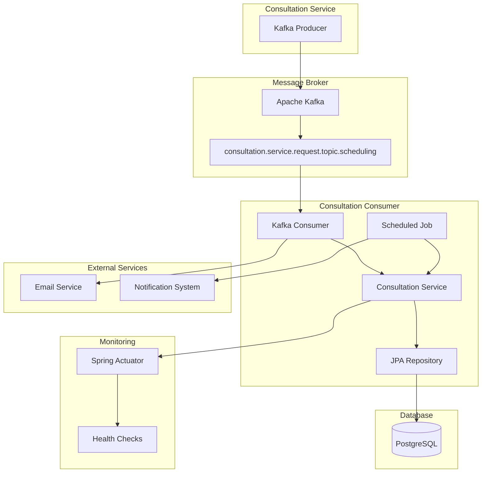

# 📨 FIAP Consultation Consumer

> **Consumidor Kafka responsável por processar agendamentos e enviar lembretes de consultas médicas**  
> *Documentação gerada com Amazon Q CLI*

[](https://github.com/itmoura/fiap-consultation-consumer/actions/workflows/ci.yml)
[](https://openjdk.java.net/projects/jdk/21/)
[](https://spring.io/projects/spring-boot)
[](https://kafka.apache.org/)
[](https://www.postgresql.org/)

## 📋 Índice

- [Sobre o Projeto](#-sobre-o-projeto)
- [Arquitetura](#-arquitetura)
- [Tecnologias Utilizadas](#-tecnologias-utilizadas)
- [Pré-requisitos](#-pré-requisitos)
- [Instalação e Execução](#-instalação-e-execução)
- [Funcionalidades](#-funcionalidades)
- [Estrutura do Projeto](#-estrutura-do-projeto)
- [Testes](#-testes)
- [Configuração](#-configuração)
- [Monitoramento](#-monitoramento)
- [CI/CD](#-cicd)
- [Contribuição](#-contribuição)

## 🎯 Sobre o Projeto

O **FIAP Consultation Consumer** é uma aplicação Spring Boot que atua como consumidor de mensagens Kafka para processar eventos de agendamento de consultas médicas. O sistema é responsável por:

- ✅ **Consumo de Mensagens Kafka**: Processa eventos de agendamento em tempo real
- ✅ **Agendamento Automático**: Job executado diariamente às 23h para lembretes
- ✅ **Persistência de Dados**: Armazena consultas no PostgreSQL
- ✅ **Simulação de Email**: Processa e simula envio de notificações
- ✅ **Monitoramento**: Health checks e métricas com Actuator

## 🏗️ Arquitetura



### Fluxo de Processamento

1. **Recebimento**: Consumer recebe mensagem do tópico Kafka
2. **Processamento**: Simula envio de email de confirmação
3. **Agendamento**: Job diário busca consultas do dia seguinte
4. **Notificação**: Envia lembretes para consultas agendadas
5. **Persistência**: Dados armazenados no PostgreSQL

## 🛠️ Tecnologias Utilizadas

### Core Framework
- **Java 21** - Linguagem de programação
- **Spring Boot 3.5.6** - Framework principal
- **Spring Data JPA** - Persistência de dados
- **Spring Kafka** - Integração com Apache Kafka
- **Spring Scheduling** - Jobs agendados

### Database & Messaging
- **PostgreSQL** - Banco de dados principal
- **H2 Database** - Banco em memória para testes
- **Apache Kafka** - Message broker para eventos
- **HikariCP** - Pool de conexões

### Testing & Quality
- **JUnit 5** - Framework de testes
- **Mockito** - Mocking para testes unitários
- **Spring Boot Test** - Testes de integração
- **@DataJpaTest** - Testes específicos de JPA

### Build & DevOps
- **Gradle 8.14.3** - Build tool
- **GitHub Actions** - CI/CD pipeline
- **Lombok** - Redução de boilerplate

## 📋 Pré-requisitos

- **Java 21** ou superior
- **Apache Kafka** (para produção)
- **PostgreSQL** (para produção)
- **Git**
- **Gradle** (opcional, wrapper incluído)

## 🚀 Instalação e Execução

### 1. Clone o Repositório

```bash
git clone https://github.com/itmoura/fiap-consultation-consumer.git
cd fiap-consultation-consumer
```

### 2. Configure o Ambiente

#### Opção A: Usando Docker (Recomendado)
```bash
# No projeto consultation-service, execute:
docker-compose up -d postgres apache-kafka
```

#### Opção B: Instalação Local
- Instale PostgreSQL e Apache Kafka
- Configure as variáveis de ambiente (veja seção [Configuração](#-configuração))

### 3. Execute a Aplicação

#### Via Gradle
```bash
# Linux/Mac
./gradlew bootRun

# Windows
gradlew.bat bootRun
```

#### Via IDE
- Importe o projeto na sua IDE
- Execute a classe `ConsultationConsumerApplication`

#### Via JAR
```bash
./gradlew build
java -jar build/libs/consultation-consumer-0.0.1-SNAPSHOT.jar
```

### 4. Verificar Execução

- **Aplicação**: http://localhost:8081
- **Health Check**: http://localhost:8081/actuator/health
- **Logs**: Verifique o console para mensagens do consumer

## ⚡ Funcionalidades

### 📨 Consumer Kafka

```java
@KafkaListener(
    topics = "${spring.kafka.consumer.consultation.topic}",
    groupId = "${spring.kafka.consumer.consultation.groupId}"
)
public void consume(String message) {
    // Processa mensagem de agendamento
    // Simula envio de email de confirmação
}
```

**Características:**
- Consome do tópico: `consultation.service.request.topic.scheduling`
- Group ID: `consultation.service-scheduling-consumer-1`
- Processamento assíncrono de mensagens
- Simulação de envio de email

### ⏰ Job Agendado

```java
@Scheduled(cron = "0 0 23 * * *", zone = "America/Sao_Paulo")
public void schedule() {
    // Executa diariamente às 23h (horário de Brasília)
    // Busca consultas do dia seguinte
    // Envia lembretes para pacientes
}
```

**Características:**
- Execução diária às **23:00** (fuso horário de São Paulo)
- Busca consultas agendadas para o dia seguinte
- Processa lembretes automáticos
- Log detalhado das operações

### 🗄️ Persistência de Dados

```java
@Query("SELECT c FROM Consultation c WHERE c.startDate BETWEEN :startDate AND :endDate")
List<Consultation> findAllConsultationTomorrow(
    @Param("startDate") LocalDateTime startDate, 
    @Param("endDate") LocalDateTime endDate
);
```

**Características:**
- Query customizada para buscar consultas por período
- Filtro por data de início e fim
- Suporte a diferentes status de consulta
- Integração com PostgreSQL

## 📁 Estrutura do Projeto

```
src/
├── main/
│   ├── java/com/fiap/itmoura/consultation_consumer/
│   │   ├── ConsultationConsumerApplication.java    # Classe principal
│   │   └── scheduling/                             # Módulo de agendamento
│   │       ├── domain/                             # Camada de domínio
│   │       │   ├── Consultation.java               # Entidade consulta
│   │       │   └── enums/
│   │       │       └── ConsultationStatusEnum.java # Status da consulta
│   │       ├── application/                        # Camada de aplicação
│   │       │   ├── usecase/
│   │       │   │   └── ConsultationService.java    # Serviço de consultas
│   │       │   └── job/
│   │       │       └── ConsultationScheduling.java # Job agendado
│   │       └── infrastructure/                     # Camada de infraestrutura
│   │           ├── persistence/
│   │           │   └── ConsultationRepository.java # Repositório JPA
│   │           └── consumer/
│   │               └── SchedulingKafkaConsumer.java # Consumer Kafka
│   └── resources/
│       └── application.yml                         # Configurações
└── test/                                           # Testes unitários (35 testes)
    ├── java/com/fiap/itmoura/consultation_consumer/
    │   ├── ConsultationConsumerApplicationTest.java
    │   └── scheduling/
    │       ├── domain/
    │       │   ├── ConsultationTest.java
    │       │   └── enums/ConsultationStatusEnumTest.java
    │       ├── application/
    │       │   ├── usecase/ConsultationServiceTest.java
    │       │   └── job/ConsultationSchedulingTest.java
    │       └── infrastructure/
    │           ├── persistence/ConsultationRepositoryTest.java
    │           └── consumer/SchedulingKafkaConsumerTest.java
    └── resources/
        └── application-test.yml                    # Configurações de teste
```

## 🧪 Testes

O projeto possui **35 testes unitários** distribuídos em **7 classes de teste**.

### Executar Testes

```bash
# Executar todos os testes
./gradlew test

# Executar com relatório detalhado
./gradlew test --info

# Executar testes específicos
./gradlew test --tests "ConsultationServiceTest"
```

### Cobertura de Testes

- ✅ **Entidade de Domínio**: Consultation (6 testes)
- ✅ **Enum**: ConsultationStatusEnum (4 testes)
- ✅ **Serviço**: ConsultationService (4 testes)
- ✅ **Repository**: ConsultationRepository (6 testes)
- ✅ **Consumer Kafka**: SchedulingKafkaConsumer (6 testes)
- ✅ **Job Agendado**: ConsultationScheduling (6 testes)
- ✅ **Aplicação**: ConsultationConsumerApplication (2 testes)

### Tipos de Teste

- **Unit Tests**: Testes isolados com mocks
- **Integration Tests**: Testes com @DataJpaTest
- **Consumer Tests**: Validação de processamento Kafka
- **Scheduler Tests**: Testes de jobs agendados

## ⚙️ Configuração

### Variáveis de Ambiente

| Variável | Descrição | Padrão |
|----------|-----------|--------|
| `SPRING_PROFILES_ACTIVE` | Profile ativo | `develop` |
| `APP_PORT` | Porta da aplicação | `8081` |
| `DB_HOST` | Host do PostgreSQL | `localhost` |
| `DB_PORT` | Porta do PostgreSQL | `5432` |
| `DB_SCHEMA` | Nome do banco | `consultation-db` |
| `BD_USER` | Usuário do banco | `postgres` |
| `BD_PASS` | Senha do banco | `root` |

### Configuração Kafka

```yaml
spring:
  kafka:
    consumer:
      consultation:
        topic: "consultation.service.request.topic.scheduling"
        groupId: "consultation.service-scheduling-consumer-1"
```

### Configuração do Job

```java
@Scheduled(cron = "0 0 23 * * *", zone = "America/Sao_Paulo")
// Para testes, use: @Scheduled(fixedDelay = 1000)
```

### Profile de Desenvolvimento

```yaml
spring:
  profiles:
    active: develop
  datasource:
    url: jdbc:postgresql://localhost:5432/consultation-db
    username: postgres
    password: root
```

### Profile de Teste

```yaml
spring:
  profiles:
    active: test
  datasource:
    url: jdbc:h2:mem:testdb
    driver-class-name: org.h2.Driver
```

## 📊 Monitoramento

### Health Checks

```bash
# Status da aplicação
GET http://localhost:8081/actuator/health

# Informações detalhadas
GET http://localhost:8081/actuator/info
```

### Logs da Aplicação

```bash
# Logs do Consumer Kafka
===== MESSAGE RECEIVED =====
{mensagem do kafka}
===== SIMULANDO ENVIO DE EMAIL =====

# Logs do Job Agendado
===== SCHEDULING JOB =====
===== LEMBRETE DE CONSULTA =====
{consultas do dia seguinte}
===== FINALIZANDO JOB =====
```

### Métricas Disponíveis

- **JVM Metrics**: Uso de memória, threads, GC
- **Kafka Metrics**: Mensagens consumidas, lag do consumer
- **Database Metrics**: Pool de conexões, queries executadas
- **Application Metrics**: Uptime, health status

## 🔄 CI/CD

### GitHub Actions Workflow

O projeto possui pipeline de CI/CD em `.github/workflows/ci.yml`:

```yaml
name: CI
on:
  push:
    branches: [ master ]
  pull_request:
    branches: [ master ]

jobs:
  test:
    runs-on: ubuntu-latest
    steps:
    - uses: actions/checkout@v4
    - name: Set up JDK 21
      uses: actions/setup-java@v4
    - name: Run tests
      run: ./gradlew test
    - name: Build application
      run: ./gradlew build
```

### Pipeline Stages

1. **Checkout**: Download do código
2. **Setup Java 21**: Configuração do ambiente
3. **Cache Gradle**: Otimização de build
4. **Run Tests**: Execução dos 35 testes
5. **Build**: Compilação da aplicação

## 📊 Modelo de Dados

### Consultation (Consulta)

```java
@Entity
public class Consultation {
    @Id
    @GeneratedValue
    private UUID id;
    
    @Column(nullable = false)
    private LocalDateTime startDate;
    
    @Column(nullable = false)
    private LocalDateTime finalDate;
    
    @Enumerated(EnumType.STRING)
    private ConsultationStatusEnum status;
    
    private String description;
}
```

### Status da Consulta

```java
public enum ConsultationStatusEnum {
    SCHEDULED("SCHEDULED"),    // Agendada
    CONFIRMED("CONFIRMED"),    // Confirmada
    CANCELLED("CANCELLED"),    // Cancelada
    COMPLETED("COMPLETED");    // Concluída
}
```

## 🔗 Integração com Outros Serviços

### Consultation Service (Producer)

- **Tópico**: `consultation.service.request.topic.scheduling`
- **Formato**: JSON com dados da consulta
- **Trigger**: Criação/atualização de consultas

### Email Service (Simulado)

- **Confirmação**: Enviado ao receber mensagem Kafka
- **Lembrete**: Enviado pelo job diário às 23h
- **Formato**: Log no console (simulação)

## 🚨 Tratamento de Erros

### Consumer Kafka

- **Retry**: Configuração automática do Spring Kafka
- **Dead Letter Topic**: Pode ser configurado para mensagens com falha
- **Logging**: Todas as mensagens são logadas

### Job Agendado

- **Exception Handling**: Erros são propagados e logados
- **Retry**: Próxima execução em 24 horas
- **Monitoring**: Status via Actuator

### Database

- **Connection Pool**: HikariCP com configuração otimizada
- **Timeout**: 24 segundos para conexões
- **Retry**: Configuração automática do Spring

## 🤝 Contribuição

### Como Contribuir

1. **Fork** o projeto
2. **Clone** seu fork: `git clone <seu-fork>`
3. **Crie uma branch**: `git checkout -b feature/nova-funcionalidade`
4. **Faça suas alterações** e **adicione testes**
5. **Execute os testes**: `./gradlew test`
6. **Commit**: `git commit -m "feat: adiciona nova funcionalidade"`
7. **Push**: `git push origin feature/nova-funcionalidade`
8. **Abra um Pull Request**

### Padrões de Desenvolvimento

- **Testes**: Manter cobertura de 100% das classes principais
- **Logs**: Usar níveis apropriados (INFO, DEBUG, ERROR)
- **Kafka**: Seguir padrões de consumer groups
- **Scheduling**: Usar cron expressions válidas

## 📞 Suporte

- **Issues**: [GitHub Issues](https://github.com/itmoura/fiap-consultation-consumer/issues)
- **Documentação**: Este README
- **Email**: italo@example.com

## 📄 Licença

Este projeto está sob a licença MIT. Veja o arquivo [LICENSE](LICENSE) para mais detalhes.

---

**Desenvolvido com ❤️ para FIAP**  
*Documentação gerada automaticamente com Amazon Q CLI*
